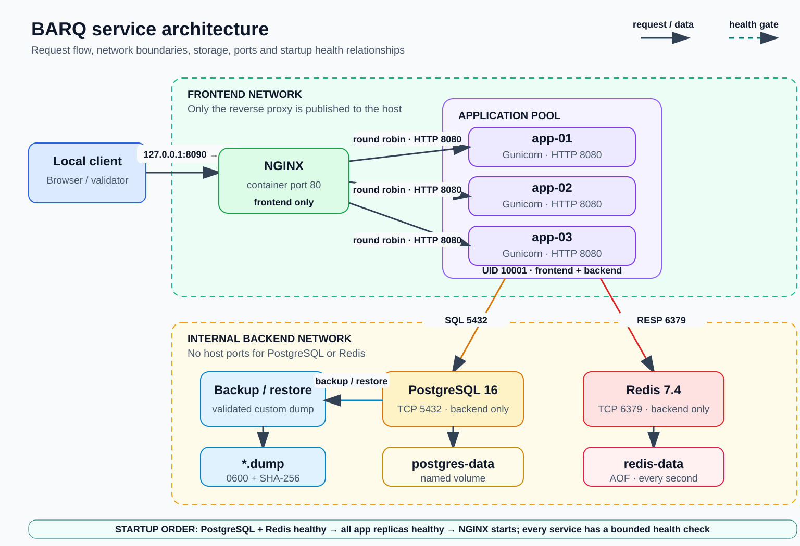

# BARQ DevOps internship assessment

This repository repairs and validates the supplied Flask, NGINX, PostgreSQL, and Redis
environment. NGINX is the only published service and balances requests across three
application replicas. The final recorded change added `app-03`, and all replicas now serve
through `http://127.0.0.1:8090`. The applications use real PostgreSQL records and a Redis
counter.

## Architecture



Requests enter through loopback port 8090 and reach NGINX on container port 80. NGINX and
the application replicas share the frontend network. The applications also join the
internal backend network to reach PostgreSQL on 5432 and Redis on 6379. Neither the
applications nor the data services publish host ports.

The editable diagram is [architecture.excalidraw](architecture.excalidraw). Detailed
choices and limitations are in [decisions.md](decisions.md), and security findings are in
[security_review.md](security_review.md).

## Prerequisites

- Linux or WSL2 with Git, Python 3.12, Docker Engine, and the Docker Compose plugin
- At least 2 CPU cores, 4 GB free RAM, and 3 GB free disk space
- Free host port 8090
- No existing containers named `app-01`, `app-02`, `app-03`, `nginx`, `postgres`, or `redis`

Use synthetic data and a local machine only. The public port is bound to loopback and is
not intended for internet exposure.

## Setup and configure the environment

Run all commands from the repository root. Create a local ignored environment file and
replace its placeholder with a generated lab password:

```bash
cp .env.example .env
sed -i "s/change-me/$(python3 -c 'import secrets; print(secrets.token_hex(24))')/" .env

export BARQ_PROJECT=barq-assessment
export BARQ_URL=http://127.0.0.1:8090
```

Confirm that the environment file is ignored and the resolved Compose configuration is
valid:

```bash
git check-ignore .env
docker compose --env-file .env -p "$BARQ_PROJECT" config --quiet
```

Compose stops immediately when `POSTGRES_PASSWORD` is absent. `.env.example` contains
only a disposable placeholder; do not commit `.env` or a real credential.

## Build and start

Build the application image, start the complete environment, and wait up to 90 seconds
for every health check:

```bash
docker compose --env-file .env -p "$BARQ_PROJECT" build
docker compose --env-file .env -p "$BARQ_PROJECT" \
  up --detach --wait --wait-timeout 90
docker compose --env-file .env -p "$BARQ_PROJECT" ps
```

Expected services are `nginx`, `app-01`, `app-02`, `app-03`, `postgres`, and `redis`; all six
should report healthy. Only NGINX should show a host binding:

```text
127.0.0.1:8090->80/tcp
```

## Exercise the API

The endpoints return JSON and identify the application replica in the `instance_id` field
and `X-Instance-ID` response header.

```bash
curl --fail --silent --show-error "$BARQ_URL/" | python3 -m json.tool
curl --fail --silent --show-error "$BARQ_URL/health" | python3 -m json.tool
curl --fail --silent --show-error "$BARQ_URL/ready" | python3 -m json.tool
curl --fail --silent --show-error "$BARQ_URL/records" | python3 -m json.tool
curl --fail --silent --show-error "$BARQ_URL/counter" | python3 -m json.tool
```

Create a synthetic PostgreSQL record:

```bash
curl --fail --silent --show-error \
  --header 'Content-Type: application/json' \
  --data '{"title":"README verification record"}' \
  "$BARQ_URL/records" | python3 -m json.tool
```

Prove that round-robin traffic reaches both replicas:

```bash
for request in $(seq 1 10); do
  curl --fail --silent --show-error "$BARQ_URL/instance"
  echo
done
```

`/health` proves that the application process can answer HTTP. `/ready` separately checks
live PostgreSQL and Redis operations and returns HTTP 503 when either dependency is
unavailable.

## Run automated checks

Run syntax checks first:

```bash
python3 -m py_compile validate.py failure_test.py scripts/analyze_logs.py
bash -n backup.sh restore.sh video_challenge.sh
docker compose --env-file .env -p "$BARQ_PROJECT" config --quiet
```

Run the application contract tests inside the same production image used by Compose:

```bash
docker compose --env-file .env -p "$BARQ_PROJECT" run --rm --no-deps \
  --volume "$PWD/tests:/srv/tests:ro,Z" \
  app-01 python -m unittest discover -s tests -v
```

Run the full environment validator:

```bash
./validate.py --project "$BARQ_PROJECT" --url "$BARQ_URL"
```

Validation exits non-zero when Compose syntax is invalid; a required container is missing,
stopped, or unhealthy; network isolation is wrong; a prohibited port is published; an
endpoint violates its contract; a real PostgreSQL or Redis operation fails; or not every
application replica serves through NGINX. Validation is read-only for infrastructure but
creates one synthetic database record and increments the Redis counter.

## Measure failure and recovery

The failure test stops exactly one container selected by Compose project and service
labels, sends 60 concurrent requests, measures successes and errors, restarts that same
container in a cleanup path, waits for health, and proves it serves traffic again:

```bash
./failure_test.py \
  --project "$BARQ_PROJECT" \
  --service app-01 \
  --url "$BARQ_URL" \
  --requests 60
```

Some errors are expected. NGINX retries are deliberately disabled so this exercise exposes
the availability of the configured round-robin design instead of hiding the stopped
replica. The recorded two-replica run produced 29 successes and 31 HTTP 504 responses.
After the final third replica was added, a 12-request verification produced 8 successes
and 4 HTTP 504 responses, followed by successful recovery. Run `validate.py` again
afterward.

## Prove persistence across container recreation

Create a unique record, force-recreate the application and PostgreSQL containers without
deleting volumes, and confirm the record remains. NGINX is recreated in the same command
so it resolves the replacement application containers:

```bash
marker="persistence-$(date -u +%Y%m%dT%H%M%SZ)"
curl --fail --silent --show-error \
  --header 'Content-Type: application/json' \
  --data "{\"title\":\"$marker\"}" \
  "$BARQ_URL/records" | python3 -m json.tool

docker compose --env-file .env -p "$BARQ_PROJECT" \
  up --detach --force-recreate --wait --wait-timeout 90 \
  postgres app-01 app-02 app-03 nginx

curl --fail --silent --show-error "$BARQ_URL/records" \
  | python3 -c 'import json,sys; marker=sys.argv[1]; records=json.load(sys.stdin)["records"]; assert any(row["title"] == marker for row in records); print("PASS:", marker, "survived recreation")' \
  "$marker"
```

This preserves the `postgres-data` named volume. Do not add `--volumes` to these commands.

## Back up and restore PostgreSQL

Create a validated custom-format dump. The script targets one healthy PostgreSQL container
using exact Compose labels, writes through a temporary file, sets mode 0600, and reports a
SHA-256 checksum:

```bash
mkdir -p backups
./backup.sh \
  --project "$BARQ_PROJECT" \
  --output backups/manual-proof.dump
```

Restore is destructive to database objects represented in the dump. The script validates
the archive first, restores in one transaction with exit-on-error behavior, and verifies
the restored `records` table:

```bash
./restore.sh \
  --project "$BARQ_PROJECT" \
  --input backups/manual-proof.dump

./validate.py --project "$BARQ_PROJECT" --url "$BARQ_URL"
```

Generated dumps are ignored by Git. The proven local drill and its limitations are recorded
in [troubleshooting.md](troubleshooting.md). Local dumps and named volumes are not a
production backup strategy.

## Inspect logs and service state

```bash
docker compose --env-file .env -p "$BARQ_PROJECT" ps --all
docker compose --env-file .env -p "$BARQ_PROJECT" logs \
  --no-color --timestamps --tail 200
```

NGINX and the application emit structured request IDs, instance identities, statuses, and
latency fields. The supplied historical logs are analyzed in [log_analysis.md](log_analysis.md),
including malformed-line handling, exact-line deduplication, incident timelines, retry
correlation, and latency calculations. Reproduce its counts with:

```bash
./scripts/analyze_logs.py
```

The original supplied log files remain unchanged.

## Stop and clean up

Stop and remove the lab containers and networks while preserving PostgreSQL and Redis
volumes:

```bash
docker compose --env-file .env -p "$BARQ_PROJECT" down --remove-orphans
```

To start again with the existing data:

```bash
docker compose --env-file .env -p "$BARQ_PROJECT" \
  up --detach --wait --wait-timeout 90
```

After taking any required backup, permanently remove this project's containers, networks,
and named volumes:

```bash
docker compose --env-file .env -p "$BARQ_PROJECT" \
  down --volumes --remove-orphans
rm -f .env backups/*.dump
```

The last operation deletes the lab's persisted PostgreSQL and Redis data. It does not use
global Docker prune commands and does not target unrelated projects.

## Continuous integration

[`.github/workflows/ci.yml`](.github/workflows/ci.yml) runs for pushes and pull requests
with read-only repository permissions and a 15-minute limit. It checks syntax, resolves
Compose, builds the application image, runs contract tests, starts the full environment,
waits for health, runs end-to-end validation, prints diagnostics on failure, and always
cleans up.

A green run proves those checks passed from a clean Ubuntu runner for that exact commit. It
does not prove production capacity, long-duration reliability, absence of vulnerabilities,
or backup durability. CI runs are available in the repository's **Actions** tab.

## Investigation and reports

- [troubleshooting.md](troubleshooting.md) records the initial failures, hypotheses, fixes,
  failed attempts, exact retests, and commit evidence.
- [log_analysis.md](log_analysis.md) answers every supplied log question with reproducible
  counts and cross-layer correlations.
- [decisions.md](decisions.md) explains the base image, health checks, networks, timeouts,
  retry behavior, restart policy, resource limits, storage, secrets, and validation design.
- [security_review.md](security_review.md) separates implemented controls from the work
  needed for production.
- [docs/EVIDENCE_INDEX.md](docs/EVIDENCE_INDEX.md) maps each final requirement to its
  file, commit, CI evidence, and video timestamp.
- [AI_USAGE.md](AI_USAGE.md) discloses assisted work and how each result was checked.

## Recorded challenge

The supplied challenge was run during the continuous recording after the stopped
environment was built and started. It created receipt
`a87d877c79d443489d22243349551007`; the fault was diagnosed and repaired without a
full-stack reset. The receipt remains local under `.assessment/` because assessment state
is intentionally ignored by Git.

The recording then changes the public endpoint from 8080 to 8090, adds `app-03`, proves the
final identities through NGINX, reruns validation, reviews the diff, commits, and pushes
the live change. Exact timestamps are indexed in
[docs/EVIDENCE_INDEX.md](docs/EVIDENCE_INDEX.md).
